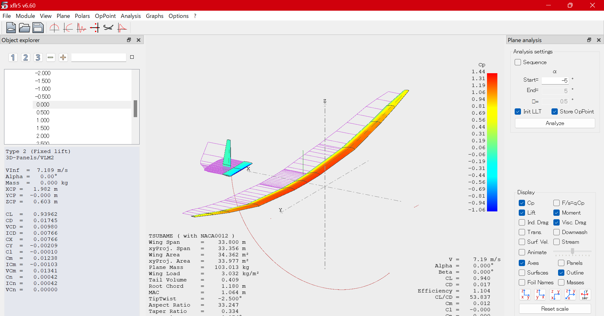

バイトに応募するときに、鳥人間で製作したもの一覧をつくった。折角なので、ホームページにも載せようと思う。

---

画像は2024年度の鳥人間コンテストに出場したMeisterの「玄鳥」である。機体設計，製作，運営など全てを学生が行う。私は電装班として，操縦系統，電装を担当した。

## 操縦系統

右が操舵機構，左が操縦桿である。私たちの機体はFBW（フライ・バイ・ワイヤ）方式を採用しており、パイロットが操縦桿を動かすと、それに合わせてサーボモータで尾翼を制御する仕組みになっている。以下が電気系統の概念図である。

私たちの代では機構設計と構造設計を一新した．これにより、昨年度のものよりもサーボモータにかかる負荷を軽減し、より安定した操縦が可能になった。また、琵琶湖の環境に合わせて、耐熱性を向上させた。

## 高度計

高度計とは、飛行機の高度を測定するための装置である。超音波センサーを用いて、地面からの距離を測定し、高度を計算する。

## ダウンリンク

ダウンリンクとは、飛行機からのデータを地上局で受信するための装置である。飛行機の状態や位置情報などをリアルタイムで受信・表示することができる。また、地上局から指示を送ることもできる。Rustで実装されている。

さらに、試験飛行の様子を撮影した動画に電装系のデータをオーバーレイした動画も作成した。Python+OpenCVで実装した。

<iframe width="791" height="368" src="https://www.youtube.com/embed/mR00Wnf7ExM" title="東京工業大学 Meister 2024 第8回TF 4th 中距離 横" frameborder="0" allow="accelerometer; autoplay; clipboard-write; encrypted-media; gyroscope; picture-in-picture; web-share" referrerpolicy="strict-origin-when-cross-origin" allowfullscreen></iframe>

動画の中で表示されているデータは以下の通りである。

- 操舵の入力値
- ケイデンス，パワー
- 対気速度
- 高度
- 姿勢角（ピッチ，ロール，ヨー）
- 滑り角
- GPSの位置情報

## フライトシミュレーター

機体の運動方程式を微小擾乱理論により線形化し、状態空間モデルを構築した。このモデルを用いて、尾翼諸元を確定させるために機体の動的特性を調べた。横方向の安定微係数の計算には、xflr5を用いた。

さらに、胴体桁を片持ち梁とみなし大変形理論による解析を行った。この解析結果を用いて、操縦系統の設計を行った。

また、このモデルを用いて、フライトシミュレーターを構築した。このシミュレーターを用いて、操縦系統の設計も行った。

本当は電装で取ったデータを使ってシミュレーターの検証をしたかったけど，いいデータが取れなくて断念してしまった．いつか後輩たちがリベンジしてくれると信じてる．