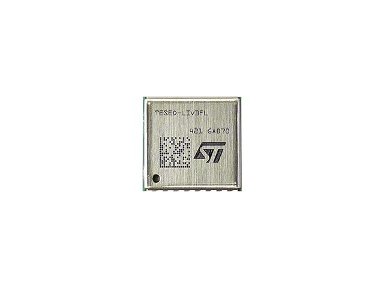
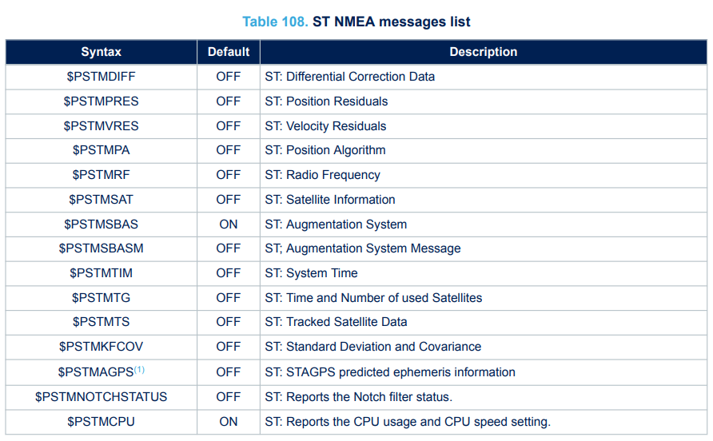
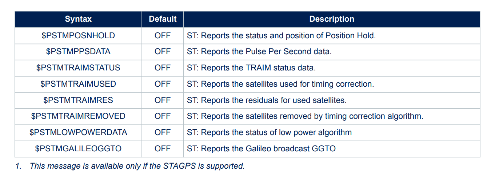
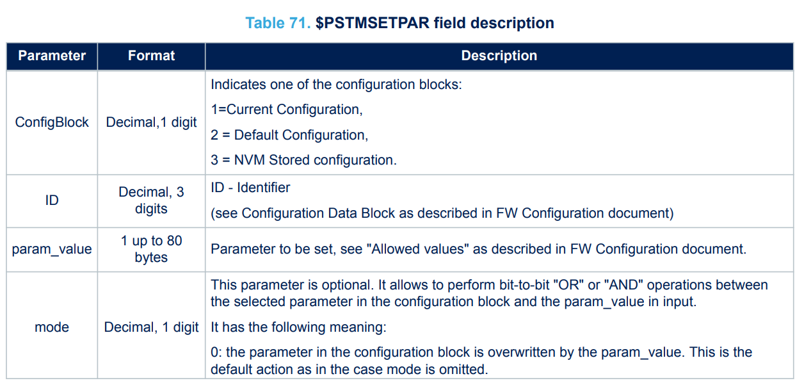
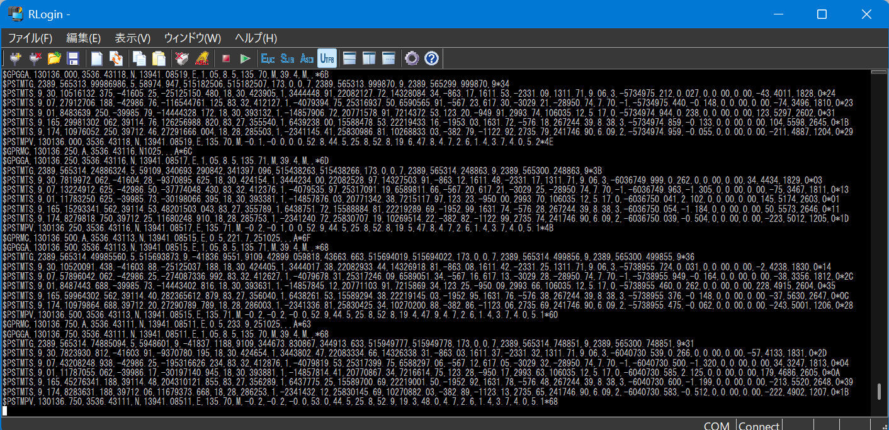
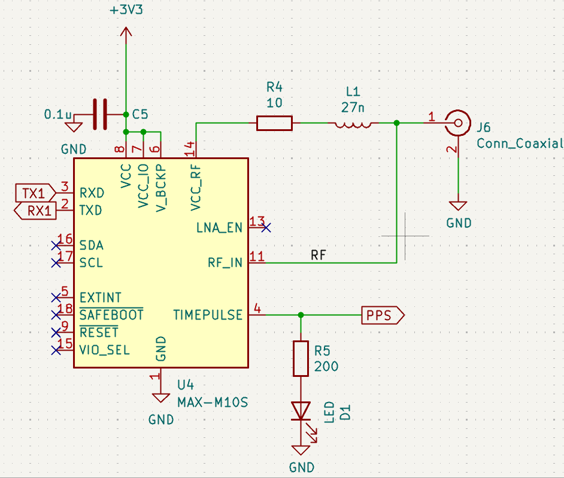

<!-- @import "[TOC]" {cmd="toc" depthFrom=1 depthTo=6 orderedList=true} -->

<!-- code_chunk_output -->

1. [Teseo LIV3FLとは](#teseo-liv3flとは)
2. [Teseo LIV3FLが吐き出せるデータ](#teseo-liv3flが吐き出せるデータ)
3. [Teseo LIV3FLの設定を変更する方法](#teseo-liv3flの設定を変更する方法)
    1. [`PSTMSETPAR` コマンド](#pstmsetpar-コマンド)
    2. [`PSTMSAVEPAR` コマンド](#pstmsavepar-コマンド)
4. [搬送波位相を取得するための設定](#搬送波位相を取得するための設定)
    1. [1. Baudrateの設定](#1-baudrateの設定)
    2. [2. メッセージの出力の設定](#2-メッセージの出力の設定)
    3. [3. (おまけ) 更新頻度の設定](#3-おまけ-更新頻度の設定)
5. [やってみた結果](#やってみた結果)
6. [今回使った回路](#今回使った回路)
7. [まとめ](#まとめ)
8. [参考文献](#参考文献)

<!-- /code_chunk_output -->


以前から開発している電装[XNavi](https://github.com/xsuz/Device-XNavi)で，Teseo LIV3FLを用いたRTK測位を試みています。RTK測位にはGNSS衛星の搬送波位相情報が必要ですが，Teseo LIV3FLからこの情報を取得する方法を探してもなかなか見つかりませんでした。

公式ドキュメントと格闘しながら何とか搬送波位相を取得する方法を見つけたので，ここにまとめておきます。

## Teseo LIV3FLとは

[](https://www.st.com/ja/positioning/teseo-liv3fl.html)

ST MicroelectronicsのGNSSレシーバモジュールです．最近，秋月でも販売されるようになり入手性が上がったため，MAX-M10Sの代替として検討しています．

安価であったためMAX-M10Sの代替として購入しましたが，製品仕様を見るとRTK測位に必要な搬送波位相情報を出力できるようです．ublox製のGNSSモジュールでは，搬送波位相情報が取得できるものは高価なものが多いため，もしTeseo LIV3FLで搬送波位相情報が取得できれば，低コストでRTK測位を実現できるようになります．

## Teseo LIV3FLが吐き出せるデータ

Teseo LIV3FLは，NMEAフォーマットに加えて，ST独自のメッセージフォーマットも出力できます．搬送波位相情報は，ST独自のメッセージフォーマットで出力されます．[UM2229 (Teseo-LIV3FL GNSS Module - Software Manual)](https://www.st.com/resource/en/user_manual/um2229-teseoliv3-gnss-module--software-manual-stmicroelectronics.pdf)の11章に，Teseo LIV3FLが出力できるメッセージの一覧があります．




この中で，搬送波位相(Carrier Phase)を含むメッセージは`PSTMTS`です．以下に示すフォーマットで与えられます．(11.5.40節より抜粋)

```plaintext
$PSTMTS,<dsp-dat>,<SatID>,<PsR>,<Freq>,<cp>,<flags>,<CN0>,
<ttim>,<Satdat>,<Satx>,<Saty>,<Satz>,<Velx>,<Vely>,<Velz>,
<src>,<ac>,<rrc>,<pr_delta>,<cp_delta>,<difdat>,<drc>,
<drrc><predavl>,<predage>,<predeph>,<predtd>*<checksum><cr><lf>
```

実際の搬送波位相は`<cp>`+`<cp_delta>`で与えられます．このメッセージを取得するのが，この記事の最終目標です．

## Teseo LIV3FLの設定を変更する方法

基本的に，Teseo LIV3FLの設定を変更すれば搬送波位相を取得できます．そこで，まずはTeseo LIV3FLの設定を変更する方法を説明します．

設定を変更する上で，Software Manualを手元に置いておくと便利です．（というか必須です）
[UM2229 (Teseo-LIV3FL GNSS Module - Software Manual)](https://www.st.com/resource/en/user_manual/um2229-teseoliv3-gnss-module--software-manual-stmicroelectronics.pdf)をダウンロードしておきます．

2.2.節に"Receiver Configuration"があり，ここで設定変更の方法が説明されています．以下抜粋．

> All configuration parameters are grouped in a data block. Each field is addressed by a unique ID. The IDs are made by three digits: the most significant one represents the parameter type and the others are used to identify different parameters of the same type.

Teseo LIV3FLの設定は，Configuration Data Block (CDB)というデータブロックで管理されていて，これをUART経由で読み書きすることで設定を変更できます．Software Manualには，更にUARTのBaudrateの設定を変更するコマンド例が載っています．

```plaintext
$PSTMSETPAR,3102,0x9
$PSTMSAVEPAR
$PSTMSRR
```

実際には，UARTで送るときは，コマンドの前に`$`を付け，最後にチェックサムと改行コードを付与する必要があります．チェックサムの計算方法はNMEAフォーマットと同じです．(後述)

重要となるコマンドは以下の2つです．

- `$PSTMSETPAR,<ID>,<VALUE>`: CDBのパラメータを設定するコマンド
- `$PSTMSAVEPAR`: CDBの設定をNVMに保存するコマンド

### `PSTMSETPAR` コマンド

```plaintext
$PSTMSETPAR,<ConfigBlock><ID>,<param_value>[,<mode>]*<checksum><cr><lf>
```

`$PSTMSETPAR`コマンドは，CDBのパラメータを設定するためのコマンドです．引数として，パラメータのIDと設定する値を指定します．IDは3桁の数字で表され，最初の桁が保存場所を表していて，2桁目と3桁目がパラメータの識別子を表しています．



ConfigBlockですが，基本的には 1 Current Configurationに保存するのが良いでしょう．3 NVM Stored configurationで保存すると失敗することが多かったです．2.2.節には以下のように書かれています．

> Default setting of configuration data block is hard coded into the binary image file.
> When the system is running, it could be possible to have up to three different configuration blocks:
>
> - Current configuration: it is placed in RAM memory and it includes the current configuration of each parameter. At start-up, the current configuration block is loaded from NVM (if a stored data block is available) or it is loaded from the default one embedded in the code (factory settings).
> - Default configuration: it is generally placed in the flash/rom memory. It includes the factory setting for each parameter. This configuration is used at system startup if there is no configuration data into the NVM memory.
> - NVM stored configuration: it is available in the NVM backup. It includes all parameters modified and stored by the user. At system startup the SW configuration management checks if a valid configuration block is available in the NVM backup memory. In case the stored configuration is available, it will be used for system configuration. If not available the default setting will be used.

パラメータの識別子については12章の"Firmware Configuration Data Block (CDB)"に詳しく書いてあるので，設定を変更する場合にはここを何回も参照することになります．

### `PSTMSAVEPAR` コマンド

```plaintext
$PSTMSAVEPAR*<checksum><cr><lf>
```

このコマンドを送らないと，設定の変更が反映されません．**`PSTMSETPAR`コマンドを送っただけでは反映されないのです．**

## 搬送波位相を取得するための設定

基本的には，Teseo LIV3FLの設定を変更して搬送波位相を出力させるだけなのですが，いくつか注意点があります．以下に手順を示します．

### 1. Baudrateの設定

デフォルトのBaudrateは9600bpsです．搬送波位相を出力させるとデータ量が増えるため，921600bpsに変更します．

12.1.節を参考にします．


ここでは，IDが1102 (UART0 Baudrate)のパラメータを0xD (921600bps)に設定します．Arduinoでのコード例を以下に示します．

```cpp
Serial1.begin(9600);
delay(1000);                                // GPSレシーバの起動を待機
Serial1.println("$PSTMSETPAR,1102,0xD*15"); // Baudrateを921600に変更
Serial1.println("$PSTMSAVEPAR");
Serial1.println("$PSTMSRR");
Serial1.setFIFOSize(8192);
Serial1.begin(921600); // baudrate 921600で再度UART0を初期化
delay(100);
```

設定したあと，Teseo LIV3FLを再起動する必要があるのが注意点です．`$PSTMSRR`コマンドを送ることで再起動できます．

### 2. メッセージの出力の設定

12.14.節を参考に，搬送波位相を含むメッセージを有効化します．同時に，不要なメッセージを無効化しておきます．
メッセージの種類が多すぎて，IDが201と208の二つに分かれているようです．

今回は，以下のメッセージを有効化します．

- `GPGGA`:  Global Position System Fix Data (Fixしているかどうかの情報)
- `GPRMC`:  Recommended Minimum Specific GNSS Data (位置，速度(2D)，時刻情報など)
- `PSTMTS`: 搬送波位相を含むエフェメリス情報
- `PSTMTG`: クロックバイアス情報（Freqの計算に必要）
- `PSTMPV`:  位置，速度(3D)，誤差共分散行列

対応するビットを1に設定して有効化します．`GPGGA`と`GPRMC`，`PSTMTS`はCDB ID 201で，`PSTMPV`はCDB ID 208で設定します．

それぞれのビットMaskは以下の通りです．

| メッセージ | ビットMask |
|------------|-----------|
| GPGGA      | 0x00000002 |
| GPRMC      | 0x00000040 |
| PSTMTG     | 0x00000100 |
| PSTMTS     | 0x00000200 |

| メッセージ | ビットMask |
|------------|-----------|
| PSTMPV      | 0x00000001 |

Arduinoでのコード例を以下に示します．

```cpp
// NMEA Port Msg-List (32bits low)
Serial1.println("$PSTMSETPAR,1201,0x00000342*54");
Serial1.println("$PSTMSAVEPAR");
// NMEA Port Msg-List (32bits high)
Serial1.println("$PSTMSETPAR,1228,0x00000001*5B");
Serial1.println("$PSTMSAVEPAR");
```

### 3. (おまけ) 更新頻度の設定

12.15.節を参考に，メッセージの出力頻度を設定します．
今回は，4Hzに設定します．5Hzなどに設定すると，Teseo LIV3FLの処理が追いつかずにデータが欠落することがありました．

Arduinoでのコード例を以下に示します．

```cpp
Serial1.println("$PSTMSETPAR,1303,0.25*03");
```

## やってみた結果

設定を変更すると，以下のように搬送波位相を含むメッセージが出力されるようになりました！！！



`$PSTMTS`メッセージを受信できているのが分かるかと思います．

## 今回使った回路

今回は，MAX-M10S用に設計した基板を流用しました．MCUであるRaspberry Pi Pico 2とTeseo LIV3FLの間はUARTで接続しています．



`PSTMTS`メッセージを受信するための回路としては，特に特殊なものは必要ありません．UARTでTeseo LIV3FLと通信できればOKです．

## まとめ

Teseo LIV3FLで搬送波位相を取得する方法を紹介しました．
今後は，TESEO LIV3FLから得られたデータをRINEX形式に変換し，RTKLIBなどでRTK測位を試してみたいと思います．

## 参考文献

- ST Microelectronics, UM2229 (Teseo-LIV3FL GNSS Module - Software Manual), https://www.st.com/resource/en/user_manual/um2229-teseoliv3-gnss-module--software-manual-stmicroelectronics.pdf , 2025/10/24閲覧