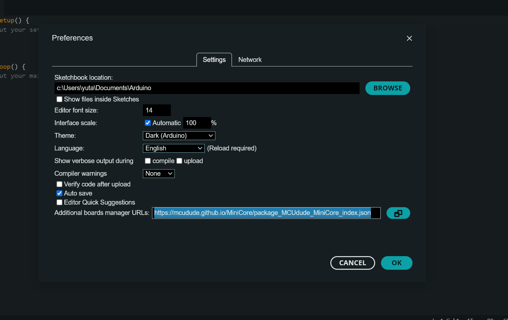
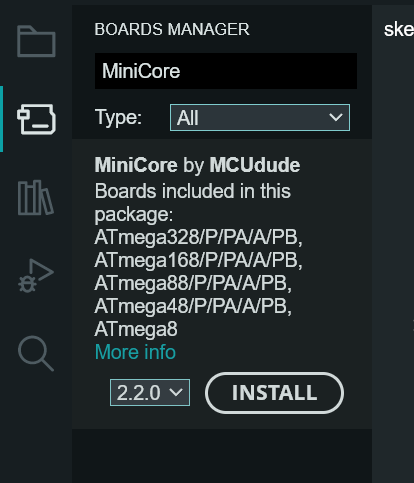
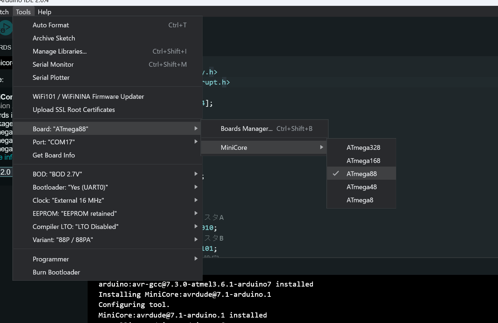
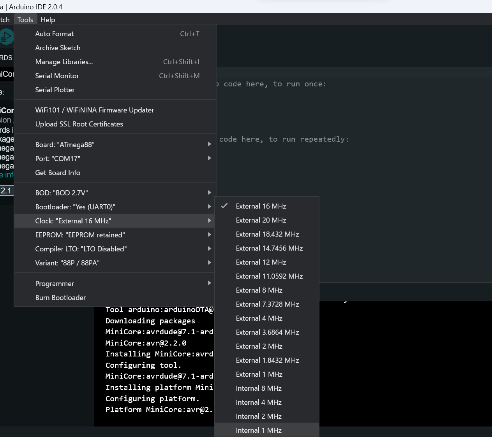
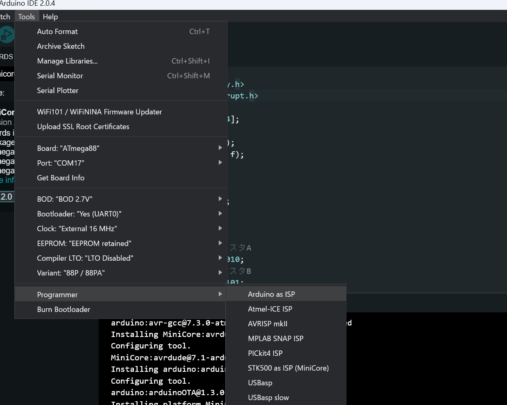

お久しぶりです～。xsuzです。

4Qの期末試験も終わり、春休みに入り、成績まで公開されちゃいました。

系所属点は上位３分の１ぐらいでした。なんだか、ぱっとしない成績ですね～。

来年こそは、機械系で一桁に入れるように頑張るぞ～！


話は変わって、新歓で作業体験をやることになりました。

そこで、AVRの入門記事を書いたのですが、折角なので個人のブログでも公開しようかなぁと考えてます。

何か間違いを見つけたら、twitterで教えてもらえると嬉しいです。

---

## 1. AVRとは

今回使うマイコンはAVRというものです。Arduino UNOに使われているマイコンもAVRです。


（秋月電子の販売ページより）

写真を見ると分かるように、マイコンにはピンがたくさんあります。小さいけど、CPUやメモリなどが全部入ってます。それだけでなくAD変換器やUARTなども組み込まれてます。

## 2. AVRマイコンのメモリ

AVRのメモリはプログラム用とデータ用に分かれています。

プログラム用メモリはCPUに命令を送るためのメモリであり、ROMが使われています。ここにデータを書き込むためにはライターが必要です。

データ用のメモリはCPUが読み書きできるメモリです。SRAMなどがあります。
SRAMは8bitのデータを持つレジスタからなります。このレジスタにも２種類あります。
データを保存するレジスタとマイコンを操作するためのレジスタです。ここでは詳しくは書きませんが、「レジスタを読み書きすることでマイコンを操作できる」ということを覚えておいてください。

## 3. 開発環境の構築

### 3.1. Arduinoをインストール

https://www.arduino.cc/en/software からArduino IDEをダウンロード&インストールしてください。


### 3.2. Board Managerを管理する

Arduino IDEを開いてPreferencesを開いてください。以下のような画面になると思います。


写真のように、`Additional board manager URLs:`の欄に```https://mcudude.github.io/MiniCore/package_MCUdude_MiniCore_index.json```を追加してください。
終わったら`OK`を押します。



次に右のボードのアイコンをクリックしてみましょう。上のようなものが出るはずです。`BOARD MANAGER`の欄に`MiniCore`と入力すると画像のように表示されるでしょう。
終わったら`INSTALL`を押してください。

### 3.3. コンパイラ、ライターの設定


まず、Tools > Board > MiniCore > ATmega88 と選択していってください。



次に、画像のように、Tools > Clock > Internal 1MHz　と選び、クロック周波数を設定します。



最後に、 Tools > Programmer > Arduino as ISP と選択してください。




以上で環境構築は終わりです。次回はLチカします。

---

## （参考）使うマイコンICについて

2023年のMeisterの新歓イベントである作業体験ではATmega88というマイコンICを使います。Arduino UNOに使われているATmega328pの弟分みたいなやつですね。

データシート：https://ww1.microchip.com/downloads/en/DeviceDoc/ATmega48_88_168_megaAVR-Data-Sheet-40002074.pdf

半導体不足の今でも250円程度ととても安いです。