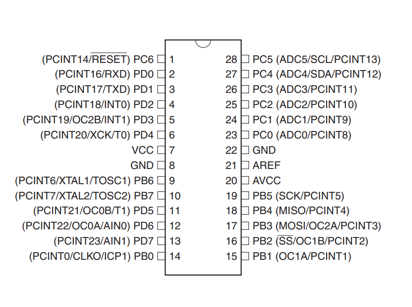
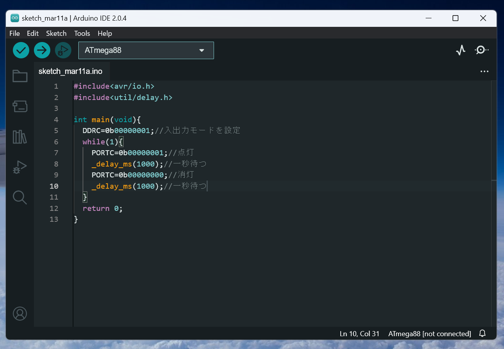

[前回](../day0/)の続きです。今回はLEDをチカチカさせます。

---

# 目次

* [第0回](../day0/) 環境構築
* 第1回 Lチカ　←ここ
* [第2回](../day2/) 7セグメントLED
* [第3回](../day3/) ダイナミック点灯
* [第4回](../day4/) タイマ割り込み
* [第5回](../day5/) サーミスタとAD変換
* [第6回](../day6/) UART
* [第7回](../day7/) I2C


---
## 5. プログラミング言語について

AVRはアセンブリ言語かC/C++言語で開発できます。私はアセンブリ言語は分からないので、今回はC言語を使って開発します。

C言語の勉強ですが、恐らく私が書いたものよりも[苦しんで覚えるC言語](https://9cguide.appspot.com/)を読んだほうが良いかと思います。必要十分量の情報が分かりやすくまとまっています。

## 6. ピンについて

今回使うマイコンICのATmega88には足がたくさんあり、この足をピンといいます。ピンにはそれぞれ役割が与えられていて、プログラムで役割を切り替えることになります。また、図のようにそれぞれのピンには名前が割り当てられています。



何も設定しない状態だと、ATmega88は以下のピンが使えます。（これらをIOポートといいます。）

- PB0,PB1,PB2,PB3,PB4,PB5
- PC0,PC1,PC2,PB3,PC4,PC5,PC6
- PD0,PD1,PD2,PD3,PD4,PD5,PD6,PD7

通常ピンは8本ずつ単位で取り扱い、Bポート、Cポートのように呼びます。ATmega88の場合は、Dポートが全てありますが、Cポートは7本、Bポートは6本だけ出ています。

ここでは、PC1に繋がったLEDをチカチカさせてみましょう。

## 7. レジスタ

ここで、マイコンのメモリの構造を見てみます。

AVRマイコンのメモリは、プログラムを格納する部分とプログラムが操作できる部分に分かれています。(このような構造をハーバード・アーキテクチャといいます)

ROMは書き込み専用で、書き込むためにはライターを使います。書き込み方については後で説明します。

さらにSRAMのなかには、マイコンの色んな機能を制御する**レジスタ**というものがあります。

DDR (Data Direction Register)はそのひとつです。これはビットそれぞれに対応するピンの入出力モードを変えることができます。

DDRのビットを0にすると入力モード、1にすると出力モードになります。

|ビット|7|6|5|4|3|2|1|0|
|:-:|:-:|:-:|:-:|:-:|:-:|:-:|:-:|:-:|
|ピン|-|PC6|PC5|PC4|PC3|PC2|PC1|PC0|
|値|-|0|0|0|1|0|0|1|

例えば、上のようにPORTCのPC0とPC3だけを出力モードにするなら、以下のように書きます。
```c
DDRC=0b00001001;
```
ここで`0b`というのは二進数ということを表しています。

### （参考）
レジスタはメモリの一種なのでアドレスを持っています。このアドレスを定義しているのが`avr/io.h`です。


## 8. プログラム

とりあえず、プログラムを書いてみましょう。今回のは以下のようになります。

```cpp
#include<avr/io.h>
#include<util/delay.h>

int main(void){
	DDRC=0b00000001;//入出力モードを設定
	while(1){
		PORTC=0b00000001;//点灯
		_delay_ms(1000);//一秒待つ
		PORTC=0b00000000;//消灯
		_delay_ms(1000);//一秒待つ
	}
	return 0;
}
```

まず、`DDRC`を使ってポートCの入出力モードを設定します。ここではPC0だけを出力モードにするので、`0b00000001`となります。

PORTCはポートCのピンのHIGH/LOWを決めるレジスタです。DDRと同様にビットに対応するピンのHIGH/LOWを決めることができます。ビットに1を書き込むとHIGH、0を書き込むとLOWとなります。

今回のプログラムではPC0のHIGH/LOWを変えます。例えば、PC0に繋がったLEDをONにしたいなら、以下のようにビットを設定します。

<div style="overflow-x: auto; white-space: nowrap">

|ビット|7|6|5|4|3|2|1|0|
|:-:|:-:|:-:|:-:|:-:|:-:|:-:|:-:|:-:|
|ピン|-|PC6|PC5|PC4|PC3|PC2|PC1|PC0|
|値|-|0|0|0|0|0|0|1|

</div>

```_delay_ms()```は指定した時間(ms)だけ待機する関数です。上のプログラムでは、1秒(=1000ms)ごとにLEDのON/OFFを切り替えています。

## 9. プログラムを書き込む

ついにプログラムを書き込みます。

1. 前回の`4.2.配線する`に従ってライターとマイコンを接続します。
1. Arduino IDEを立ち上げて、作ったプログラムを書きます。

1. ライターとPCを繋げます。
1. Ctrl+Shift+Uと押せば書き込むことができます。


以上で第一回は終わりです。[次回](../day2/)は7セグメントLEDを使います。