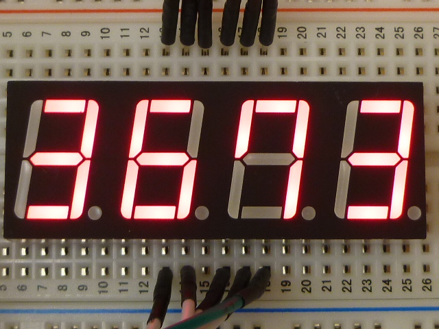
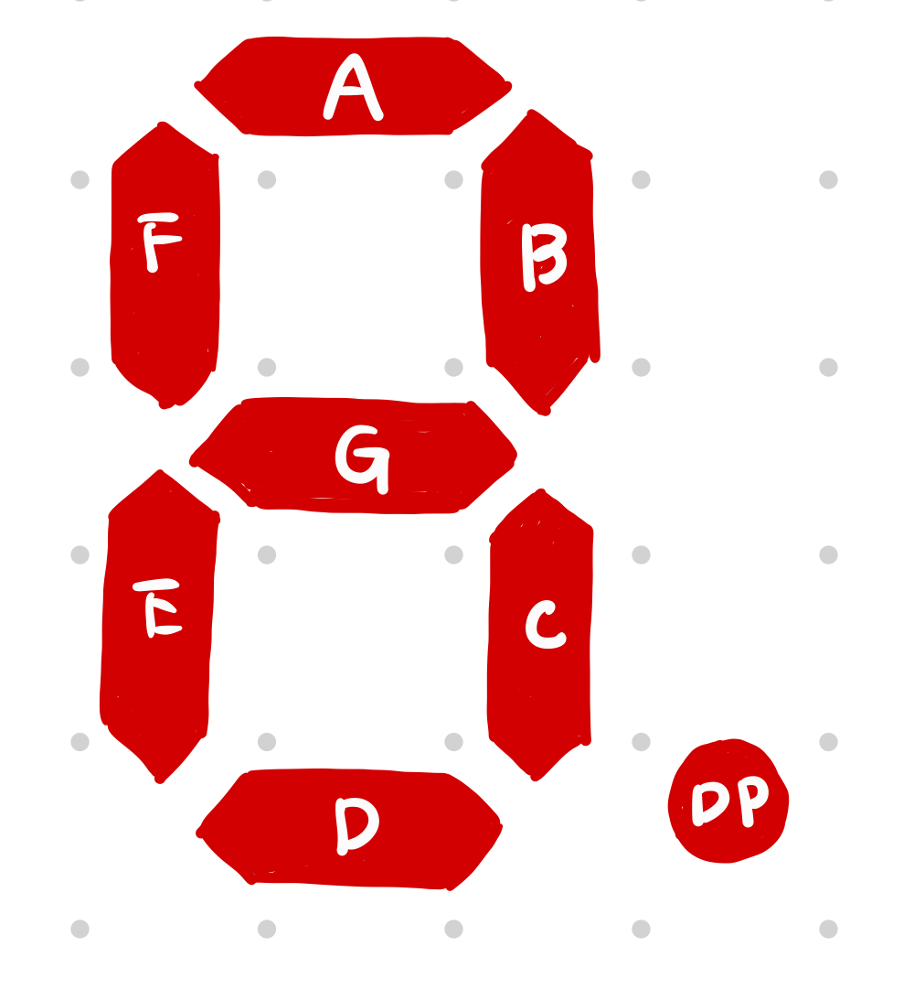
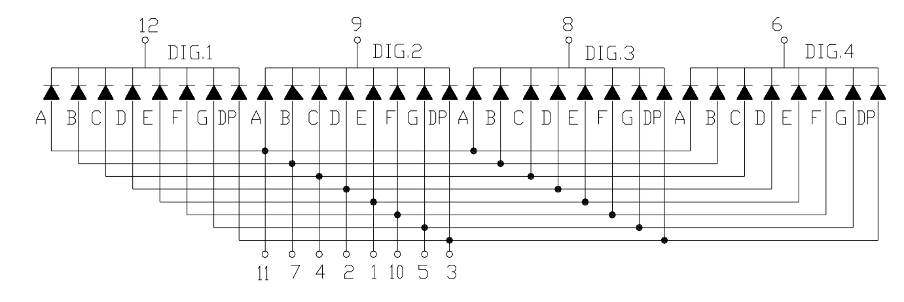

[前回](../day1/)の続きです。今回は７セグで数字を表示します。

---

# 目次

* [第0回](../day0/) 環境構築
* [第1回](../day1/) Lチカ
* 第2回 7セグメントLED　←ここ
* [第3回](../day3/) ダイナミック点灯
* [第4回](../day4/) タイマ割り込み
* [第5回](../day5/) サーミスタとAD変換
* [第6回](../day6/) UART
* [第7回](../day7/) I2C

---

## 10. 7セグメントLEDとは

まず、今回扱う７セグメントLEDについて説明します。



７セグメントLEDとは上の画像のようなLEDを使った表示器のことをいいます。７個のLEDを使い一桁の数字を表すことから、その名前がつきました。

下の図のように、それぞれの辺ごとにLEDが配置されています。例えば、「7」と表示したければ、AとBとCのLEDを点灯すれば良いわけです。

</img>

７セグでは、それぞれの桁で、LEDのカソード側（-側）もしくはアノード(+側)がくっついています。カソード側がくっついたものを**カソードコモン**、アノード側がくっついたものを**アノードコモン**といいます。今回はカソードコモンを使います。



7セグの回路図です。今回は、DIG1とGNDの接続をPB0の出力で決めます。PB0をHIGHにすると繋がるような回路にします。以下が７セグを制御するための回路図です。[^1]


## 11. プログラム

前回と10.の内容を参考にして、0~9までを1秒ごとに繰り返しカウントアップするプログラムを書いてみましょう。

↓ プログラム例

<details>

```cpp
#include<avr/io.h>
#include<util/delay.h>


void display(int);

int main(void){
	DDRD=0xFF;
	PORTD=0b00000000;
	DDRB=0x01;
	PORTB=0x01;
	int d=0;
	while(1){
		display(d);
		_delay_ms(1000);
		d=(d+1)%10;
	}
	return 0;
}

void display(int d){
	/*ピンの接続:
	 * PORTD:
	 * 	0 -> A		
	 * 	1 -> B		    A
	 * 	2 -> C		  +---+
	 * 	3 -> D		F | G |B
	 * 	4 -> E		  +---|
	 * 	5 -> F		E |   |C
	 * 	6 -> G		  +---+ .
	 * 	7 -> DP		    D   DP
	 * */
	const unsigned char digit[]={0x3F,0x06,0x5B,0x4F,0x66,0x6D,0x7D,0x07,0x7F,0x6F};
	if(0<=d && d<=9){
		PORTD=digit[d];
	}
}
```

### プログラムの解説

* 8,9行目:PORTDはPD0からPD7まで全て出力モードとして使いたいため、DDRDを0xFFとします。
* 10,11行目:PORTCはPB0だけを出力モードとして使いたいのでDDRDの0桁目のビットだけを1にします。また、PB0をONにしたいのでPORTDの0桁目のビットだけを1にします。
* 12行目:ここでは変数dを7セグで表示します。
* 13~17行目:「dの値を7セグで表示して一秒待つ」という処理を何回も繰り返します。
* 16行目:dは0,1,2,...,9,0,1,...と変化します。やっていることはdに１足して10で割ったあまりをdに入れています。
* 21~37行目:今回のプログラムの一番重要な部分です。dの値に合わせてLEDのON/OFFを変更する関数です。
* LEDのON/OFFはPORTDのピンで制御できます。そのため、レジスタPORTDの値を決めることによって文字を表示できることになります。
例えば、「7」を表示したければ、PD0,PD1,PD2をHIGHにすればよいのでPORTDの0,1,2桁目のビットを1にします。
|ビット|7|6|5|4|3|2|1|0|
|:-:|:-:|:-:|:-:|:-:|:-:|:-:|:-:|:-:|
|ピン|PD7|PD6|PD5|PD4|PD3|PD2|PD1|PD0|
|LED|DP|G|F|E|D|C|B|A|
|値|0|0|0|0|0|1|1|1|

つまり、PORTD=0x07とすれば良いことが分かります。


</details>

今回はこれで終了です。[次回](../day3)は4桁全てを点灯させてみます。

[^1]: 分かりやすくするために、書き込み回路とRESETピンのpull-up抵抗は省略しました。