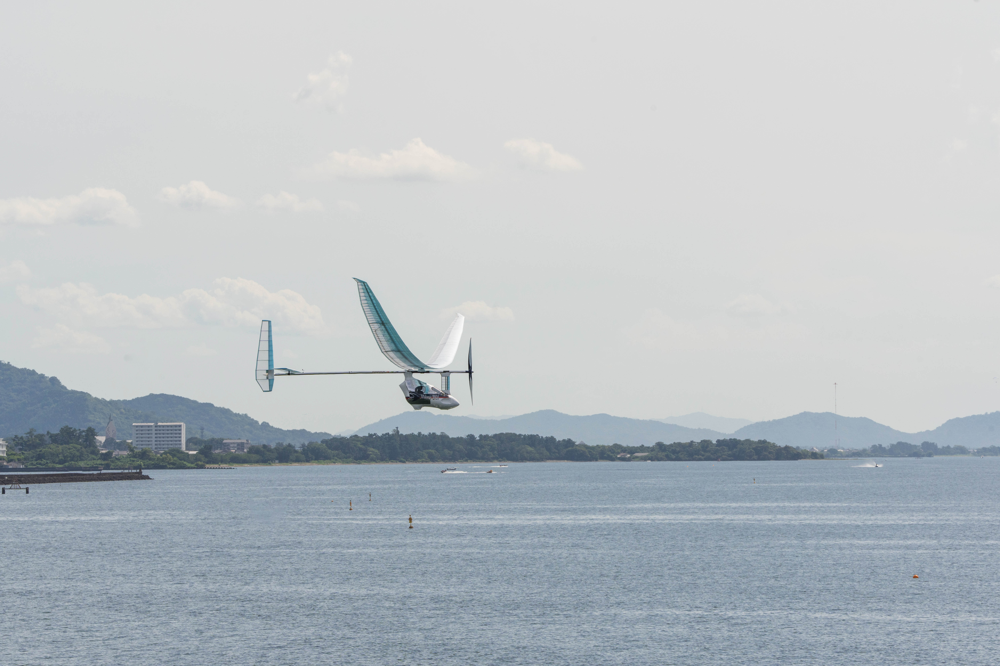
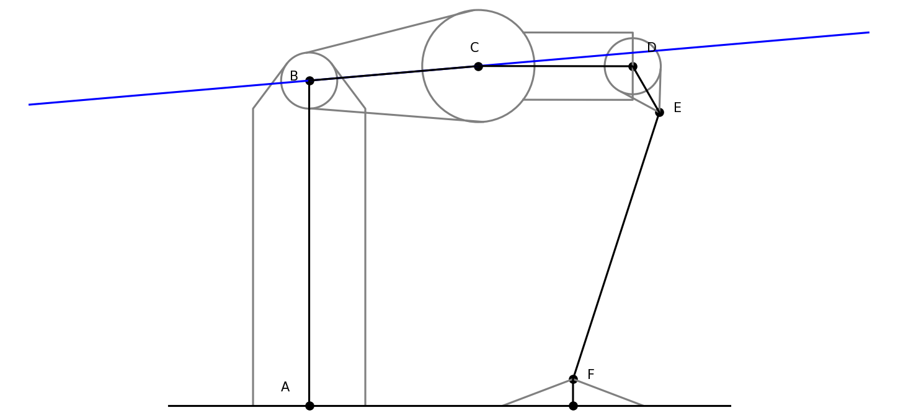
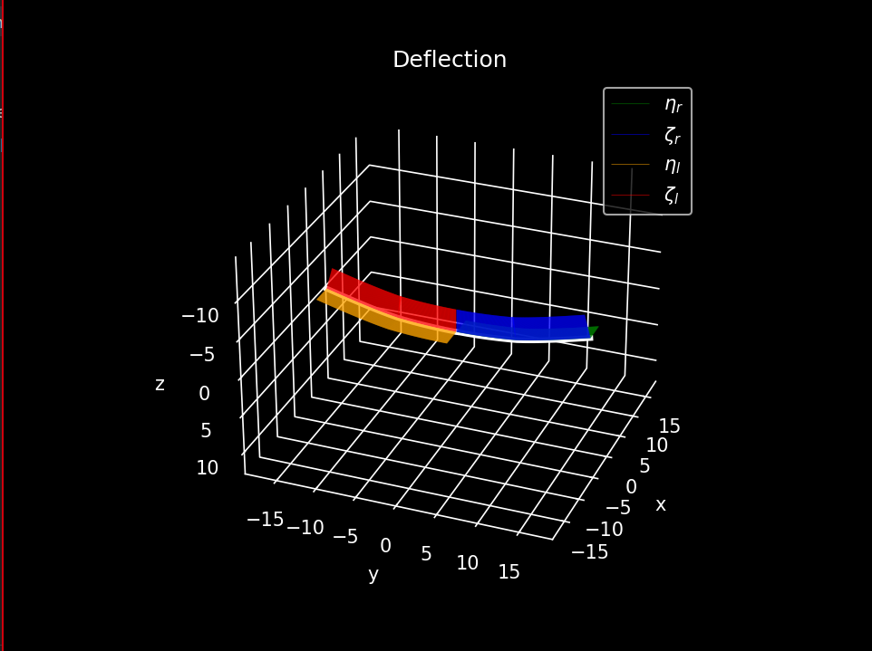
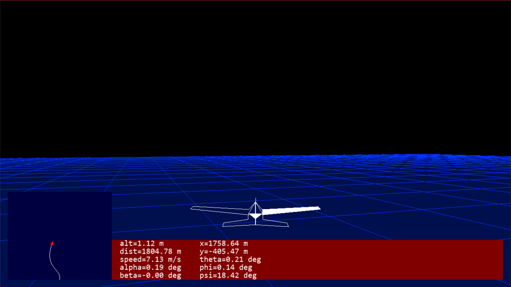

バイトに応募するときに、鳥人間で製作したもの一覧をつくった。折角なので、ホームページにも載せようと思う。

---

画像は2024年度の鳥人間コンテストに出場したMeisterの「玄鳥」である。機体設計，製作，運営など全てを学生が行う。私は電装班として，操縦系統，電装を担当した。

## 操縦系統

操舵系統とは飛行機が針路や姿勢を制御するための尾翼の回転機構や制御機器である。パイロットが操縦桿を動かすと、電気的に尾翼が動くようになっている。
機構設計と構造設計を一新し、昨年度のものよりもサーボモータにかかる負荷を軽減し、より安定した操縦が可能になった。また、琵琶湖の環境に合わせて、耐熱性を向上させた。

## 高度計

高度計とは、飛行機の高度を測定するための装置である。超音波センサーを用いて、地面からの距離を測定し、高度を計算する。

## ダウンリンク

ダウンリンクとは、飛行機からのデータを地上局で受信するための装置である。飛行機の状態や位置情報などをリアルタイムで受信・表示することができる。また、地上局から指示を送ることもできる。Rustで実装されている。

## フライトシミュレーター

機体の運動方程式を微小擾乱理論により線形化し、状態空間モデルを構築した。このモデルを用いて、尾翼諸元を確定させるために機体の動的特性を調べた。また、このモデルを用いて、フライトシミュレーターを構築した。このシミュレーターを用いて、操縦系統の設計を行った。

本当は電装で取ったデータを使ってシミュレーターの検証をしたかったけど，いいデータが取れなくて断念してしまった．いつか後輩たちがリベンジしてくれると信じてる．