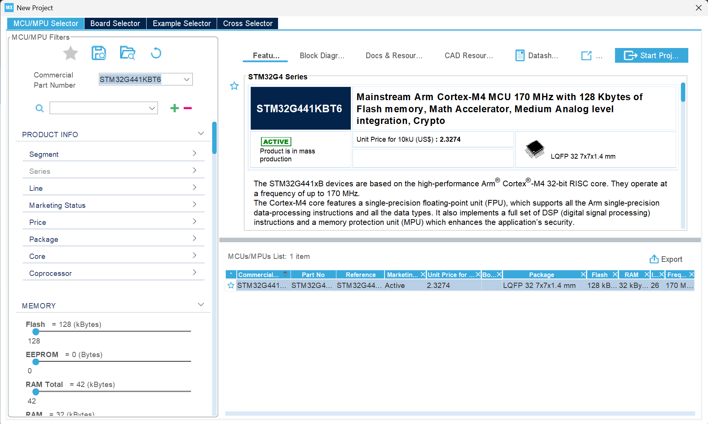
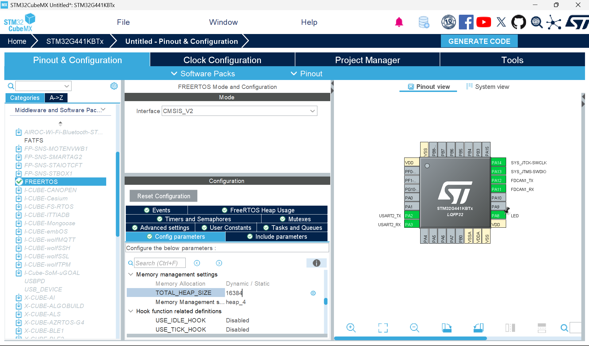
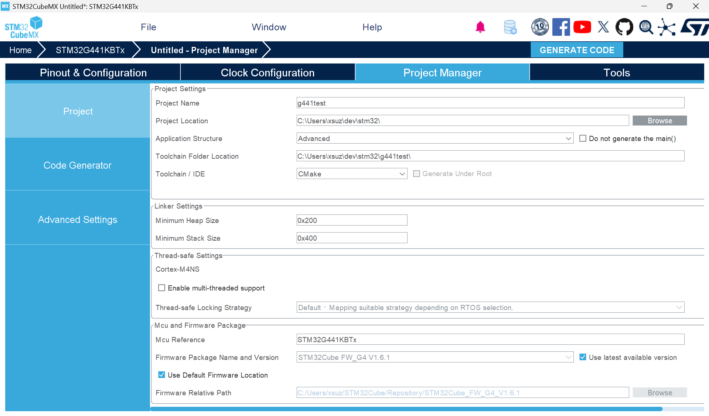
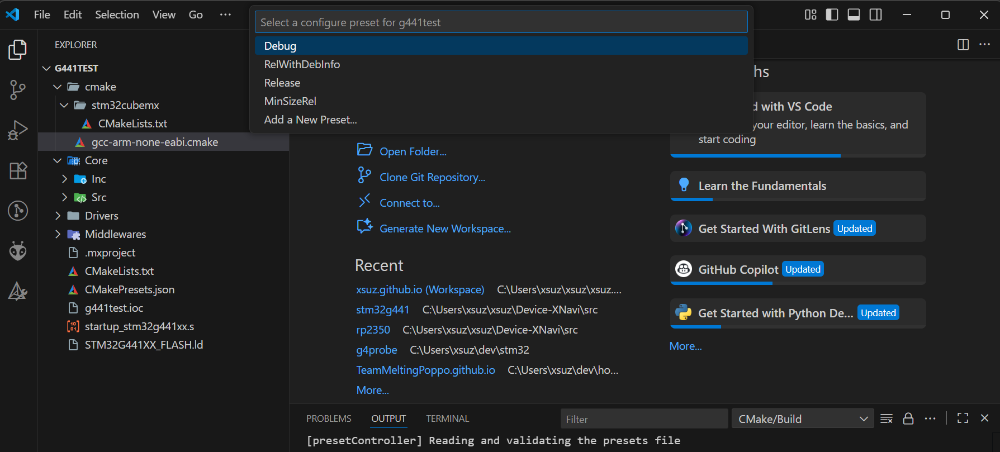
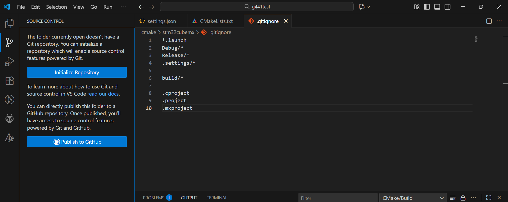
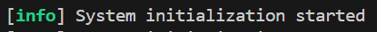
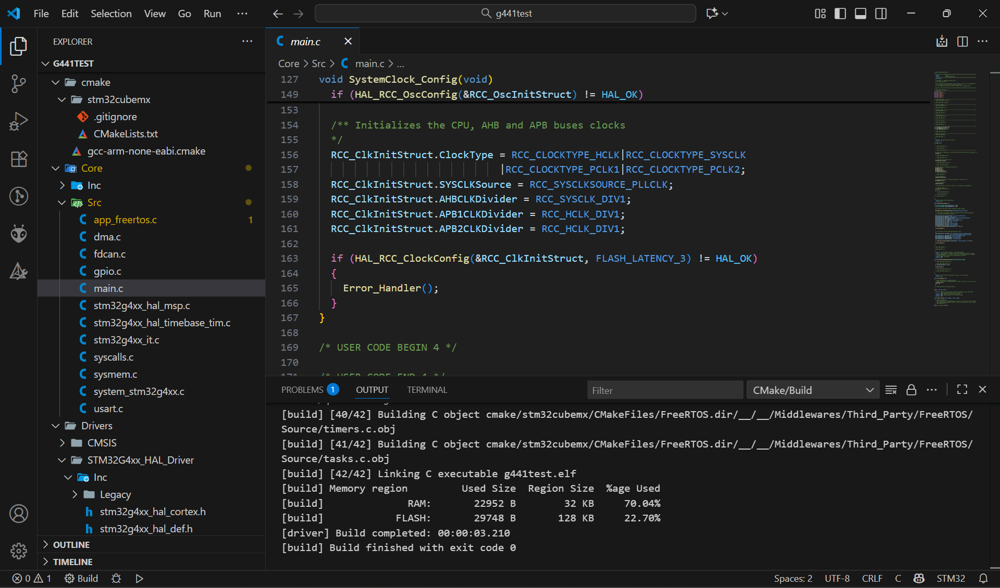
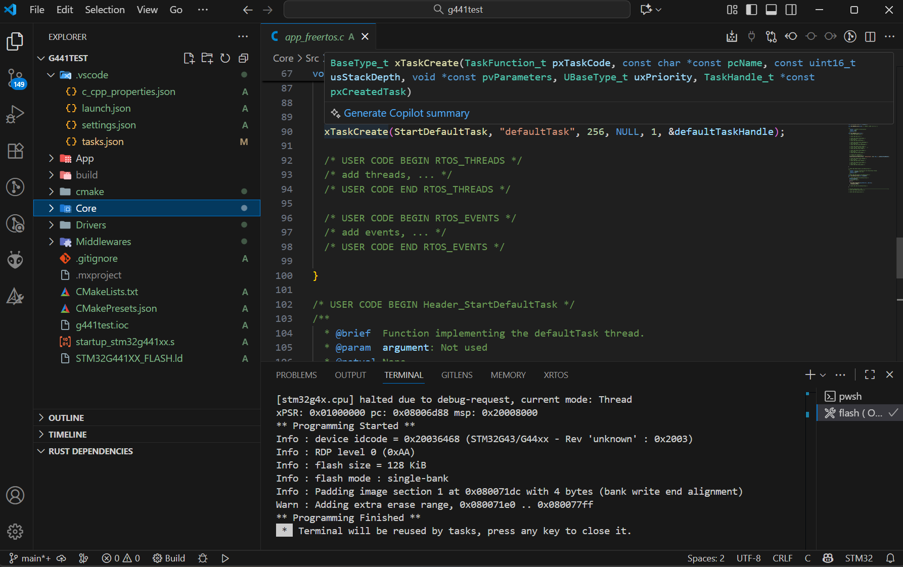
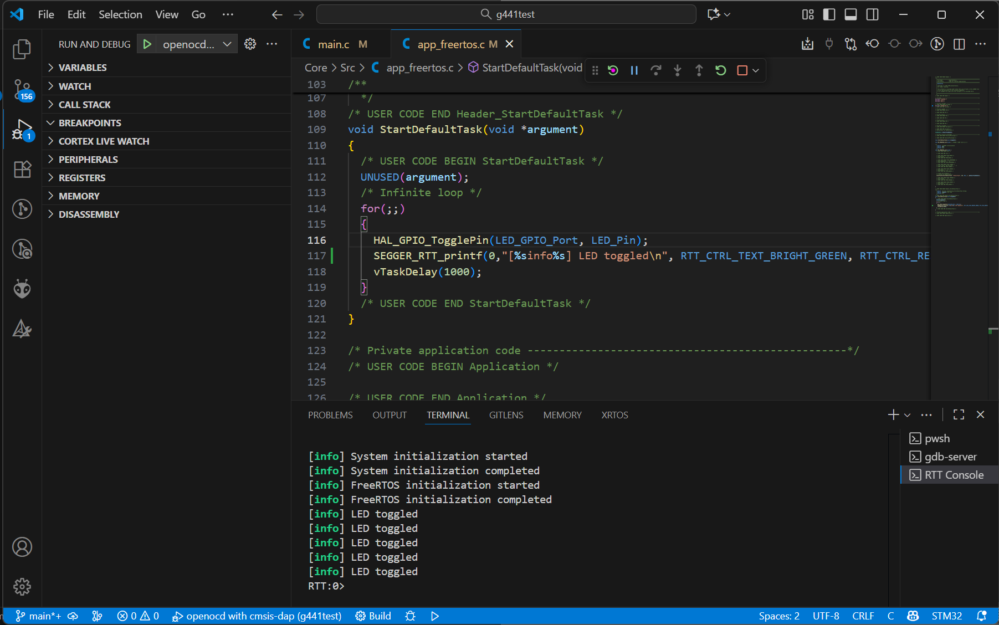

# 目次

<!-- @import "[TOC]" {cmd="toc" depthFrom=2 depthTo=6 orderedList=false} -->

<!-- code_chunk_output -->

- [はじめに](#はじめに)
- [環境・バージョンなど](#環境バージョンなど)
- [必要なものを入れる](#必要なものを入れる)
  - [Arm GNU Toolchainのインストール](#arm-gnu-toolchainのインストール)
  - [openocdのインストール](#openocdのインストール)
  - [CMake,Ninjaのインストール](#cmakeninjaのインストール)
  - [VSCodeに必要なプラグインを入れる](#vscodeに必要なプラグインを入れる)
- [STM32CubeMXでコードを生成する](#stm32cubemxでコードを生成する)
- [VSCodeでプロジェクトを取り込む](#vscodeでプロジェクトを取り込む)
  - [CMakeの設定](#cmakeの設定)
  - [Intellisenseの設定をする](#intellisenseの設定をする)
  - [ビルドタスクの設定](#ビルドタスクの設定)
  - [Debugの設定](#debugの設定)
- [Gitの設定をする](#gitの設定をする)
- [SEGGER-RTTを使えるようにする](#segger-rttを使えるようにする)
  - [本家のファイルをコピーする](#本家のファイルをコピーする)
  - [設定用ファイルをコピーする](#設定用ファイルをコピーする)
  - [初期化処理を追加](#初期化処理を追加)
  - [使い方](#使い方)
- [使い方](#使い方-1)
  - [ビルド](#ビルド)
  - [ビルド & 書き込み](#ビルド--書き込み)
  - [デバッグ](#デバッグ)
- [最後に](#最後に)

<!-- /code_chunk_output -->


## はじめに

普段はRaspberry Pi PicoやXIAO ESP32C3などをPlatformIOで開発している私ですが，platformIOで対応してないSTM32の石の開発にはCubeIDEを使っていました．

しかし，VSCodeのモダンな環境に比べると組み込み系のIDEはまだまだ使いづらいと感じています．

そこで，STM32の開発環境をVSCodeを中心に構築してみました．

大雑把に以下の流れで開発します．

1. ペリフェラルの初期化コードはSTM32CubeMXで生成する
1. VSCodeで中身をC++で書く
1. CMake+Ninjaでビルドする
1. probe-rsでデバッグする

## 環境・バージョンなど

- Windows 11 Home 24H2
- Dell Inspiron 5425
- STM32CubeMX 6.14.1
- Arm GNU Toolchain 14.2.Rel1 (Build arm-14.52)
- CMake 4.1.0
- Ninja 1.13.1
- (cargo 1.89.0)

## 必要なものを入れる

### Arm GNU Toolchainのインストール

[ここ](https://developer.arm.com/downloads/-/arm-gnu-toolchain-downloads)から自分の環境にあったものをダウンロードします．私の環境はWindows 64bitなので`arm-gnu-toolchain-XX.X.rel1-mingw-w64-x86_64-arm-none-eabi.zip`をダウンロードしました．

次に，展開したzipファイルを適当な場所（例えば`C:\tools`）に展開します．

そして，`展開した場所/arm-gnu-none-eabi/bin`にPathを通します．

### openocdのインストール

[ここ](https://gnutoolchains.com/arm-eabi/openocd/)からダウンロードしたものを使いました．

Arm GNU Toolchainと同様に，展開してPathを通します．

### CMake,Ninjaのインストール

ビルドのために使うCMakeとNinjaを入れます．Windowsの場合はwingetで簡単に入ります．
```shell
winget install cmake ninja-build.ninja
```

### VSCodeに必要なプラグインを入れる

最低限以下のプラグインを入れておけば大丈夫です．

- C/C++
- Cortex Debug

加えて，CMake用のプラグインを入れておくと便利です．

- CMake Tools

## STM32CubeMXでコードを生成する

今回はSTM32G441KBTxをターゲットにします．



まずは，ピン割り当てやクロックなどの設定を変更します．今回は，クロックとFreeRTOSの設定を変更しました．



次に，CubeMXのProject Managerから，以下の項目を設定します．

- Project
    - Application Structure
        - [x] Advanced
    - Toolchain/IDE
        - [x] CMake
- Code Generator
    - STMCube MCU packages and embedded software packs
        - [x] Copy only the necessary library files
    - Generated files
        - [x] Generate peripheral initialization as a pair of '.c/.h' files per peripheral
        - [x] Keep User Code when re-generating
        - [x] Deletepreviously generated files when not re-generated



ここまで来たら，`GENERATE CODE`をクリックし，コードを生成します．

## VSCodeでプロジェクトを取り込む

以下のようなディレクトリ構造になっているはずです．

```
├─cmake
│  └─stm32cubemx
├─Core
│  ├─Inc
│  ├─Src
│  └─Startup
├─Drivers
│  ├─CMSIS
│  └─STM32G4xx_HAL_Driver
└─Middlewares
    └─Third_Party
        └─FreeRTOS
.cproject
.mxproject
.project
CMakeLists.txt
CMakePresets.json
startup_stm32g441xx.s
STM32G441XX_FLASH.ld
```

### CMakeの設定

`.vscode/settings.json`を以下のように編集します．

```json title=.vscode/settings.json
{
    "cmake.cmakePath": "cmake",
    "cmake.preferredGenerators": [
        "Ninja"
    ]
}
```

保存したら，左下にある`⚙Build`をクリックします．すると，以下のような画面になるので，`Debug`を選択します．



CubeMXが吐いたCMakeのままだと，cppファイルなどを追加しても反映されないです．
それだと不便なので，`cmake/stm32cubemx/CMakeLists.txt`を書き換えます．

```cmake title=cmake/stm32cubemx/CMakeLists.txt "MX_Application_Src" "STM32_Drivers_Src" "FreeRTOS_Src"
cmake_minimum_required(VERSION 3.22)
# Enable CMake support for ASM and C languages
enable_language(C ASM)
# STM32CubeMX generated symbols (macros)
set(MX_Defines_Syms 
	USE_HAL_DRIVER 
	STM32G441xx
    $<$<CONFIG:Debug>:DEBUG>
)

# STM32CubeMX generated include paths
set(MX_Include_Dirs
    ${CMAKE_SOURCE_DIR}/Core/Inc
    ${CMAKE_SOURCE_DIR}/Drivers/STM32G4xx_HAL_Driver/Inc
    ${CMAKE_SOURCE_DIR}/Drivers/STM32G4xx_HAL_Driver/Inc/Legacy
    ${CMAKE_SOURCE_DIR}/Middlewares/Third_Party/FreeRTOS/Source/include
    ${CMAKE_SOURCE_DIR}/Middlewares/Third_Party/FreeRTOS/Source/CMSIS_RTOS_V2
    ${CMAKE_SOURCE_DIR}/Middlewares/Third_Party/FreeRTOS/Source/portable/GCC/ARM_CM4F
    ${CMAKE_SOURCE_DIR}/Drivers/CMSIS/Device/ST/STM32G4xx/Include
    ${CMAKE_SOURCE_DIR}/Drivers/CMSIS/Include
)

# STM32CubeMX generated application sources

file(GLOB MX_Application_Src
    ${CMAKE_SOURCE_DIR}/Core/Src/*.c
    ${CMAKE_SOURCE_DIR}/Core/Src/*.cpp
    ${CMAKE_SOURCE_DIR}/startup_stm32g441xx.s
)

list(REMOVE_ITEM MX_Application_Src
    ${CMAKE_SOURCE_DIR}/Core/Src/system_stm32g4xx.c
)

# STM32 HAL/LL Drivers
file(GLOB STM32_Drivers_Src
    ${CMAKE_SOURCE_DIR}/Core/Src/system_stm32g4xx.c
    ${CMAKE_SOURCE_DIR}/Drivers/STM32G4xx_HAL_Driver/Src/*.c
)

# Drivers Midllewares


file(GLOB FreeRTOS_Src
    ${CMAKE_SOURCE_DIR}/Middlewares/Third_Party/FreeRTOS/Source/*.c
    ${CMAKE_SOURCE_DIR}/Middlewares/Third_Party/FreeRTOS/Source/CMSIS_RTOS_V2/cmsis_os2.c
    ${CMAKE_SOURCE_DIR}/Middlewares/Third_Party/FreeRTOS/Source/portable/MemMang/heap_4.c
    ${CMAKE_SOURCE_DIR}/Middlewares/Third_Party/FreeRTOS/Source/portable/GCC/ARM_CM4F/port.c
)

# Link directories setup
set(MX_LINK_DIRS

)
# Project static libraries
set(MX_LINK_LIBS 
    STM32_Drivers
    FreeRTOS
	
)
# Interface library for includes and symbols
add_library(stm32cubemx INTERFACE)
target_include_directories(stm32cubemx INTERFACE ${MX_Include_Dirs})
target_compile_definitions(stm32cubemx INTERFACE ${MX_Defines_Syms})

# Create STM32_Drivers static library
add_library(STM32_Drivers OBJECT)
target_sources(STM32_Drivers PRIVATE ${STM32_Drivers_Src})
target_link_libraries(STM32_Drivers PUBLIC stm32cubemx)


# Create FreeRTOS static library
add_library(FreeRTOS OBJECT)
target_sources(FreeRTOS PRIVATE ${FreeRTOS_Src})
target_link_libraries(FreeRTOS PUBLIC stm32cubemx)

# Add STM32CubeMX generated application sources to the project
target_sources(${CMAKE_PROJECT_NAME} PRIVATE ${MX_Application_Src})

# Link directories setup
target_link_directories(${CMAKE_PROJECT_NAME} PRIVATE ${MX_LINK_DIRS})

# Add libraries to the project
target_link_libraries(${CMAKE_PROJECT_NAME} ${MX_LINK_LIBS})

# Add the map file to the list of files to be removed with 'clean' target
set_target_properties(${CMAKE_PROJECT_NAME} PROPERTIES ADDITIONAL_CLEAN_FILES ${CMAKE_PROJECT_NAME}.map)

# Validate that STM32CubeMX code is compatible with C standard
if((CMAKE_C_STANDARD EQUAL 90) OR (CMAKE_C_STANDARD EQUAL 99))
    message(ERROR "Generated code requires C11 or higher")
endif()
```

編集箇所は，MX_Application_SrcとSTM32_Drivers_Src，FreeRTOS_Srcに値をセットするところです．wildcardで指定するようにしています．

`Core/Src/system_stm32g4xx.c`がMX_Application_Srcではなく，STM32_Drivers_Srcに含まれるので注意して下さい．


### Intellisenseの設定をする

VSCode側にinclude pathを設定することで，補完をいい感じにします．

```json title=.vscode/c_cpp_properties.json
{
    "configurations": [
        {
            "name": "STM32",
            "includePath": [
                "${workspaceFolder}/**",
                "${workspaceFolder}/**/**"
            ],
            "defines": [
                "USE_HAL_DRIVER",
                "STM32G441xx",
                "__weak=__attribute__((weak))"
            ],
            "compilerPath": "arm-none-eabi-gcc",
            "cStandard": "c11",
            "cppStandard": "c++17",
            "intelliSenseMode": "clang-x64"
        }
    ],
    "version": 4
}
```

### ビルドタスクの設定

次に，ビルド&書き込みを自動化するための設定をします．`tasks.json`に

- ninjaでビルドするタスク
- openocdで書き込むタスク

を用意して，書き込みを行うタスクのdependOnにビルドのタスクを追加します．こうすることで，書き込むときに自動的にビルドも行うようにしてくれます．

なお，`g441test.elf`の部分はCubeMXのプロジェクト名によって変わります．（今回はプロジェクト名をg441testにした）

```json title=.vscode/tasks.json "g441test.elf"
{
    "version": "2.0.0",
    "tasks": [
		{
			"label": "build",
			"type": "shell",
			"command": "ninja",
			"args": [
				"-C",
				"./build/Debug",
			],
			"problemMatcher": [],
			"group": {
				"kind": "build",
				"isDefault": false
			}
		},
		{
			"label": "flash ( OpenOCD + CMSIS-DAP )",
			"type": "shell",
			"command": "openocd",
			"args": [
				"-f",
				"interface/cmsis-dap.cfg",
				"-f",
				"target/stm32g4x.cfg",
				"-c",
				"'program ./build/Debug/g441test.elf; reset; exit'"
			],
			"dependsOn":[
				"build"
			],
			"problemMatcher": [],
			"group": {
				"kind": "build",
				"isDefault": true
			}
		}
	]
}
```

### Debugの設定

デバッグの設定も行います．デバッグの設定は`launch.json`に書きます．

*rttConfig*を設定するのがポイントで，これによってSEGGER RTTの出力をターミナルから確認することができます．

`tasks.json`と同様に`g441test.elf`の部分はCubeMXのプロジェクト名によって変わります．

```json title=launch.json "g441test.elf"
{
    "configurations": [
        {
            "cwd": "${workspaceRoot}",
            "executable": "./build/Debug/g441test.elf",
            "name": "openocd with cmsis-dap",
            "request": "launch",
            "type": "cortex-debug",
            "servertype": "openocd",
            "configFiles": [
                "interface/cmsis-dap.cfg",
                "target/stm32g4x.cfg"
            ],
            "rttConfig": {
                "enabled": true,
                "address": "auto",
                "decoders": [
                    {
                        "label": "RTT Console",
                        "port": 0,
                        "type": "console"
                    }
                ]
            },
            "searchDir": [],
            "runToEntryPoint": "main",
            "showDevDebugOutput": "none"
        }
    ]
}
```

## Gitの設定をする

コードを再生成したときに上書きされてしまうと面倒なため，Gitのrepoもこの段階でつくってしまいます．

`.gitignore`を編集します．

```txt title=.gitignore
*.launch
Debug/*
Release/*
.settings/*
.mxproject
.cproject
.project
build
```

次に，左のGitのタブの`Initialize Repository`をクリックしRepoを作ります．



全部のファイルを追加しておきます．

```shell
git add .
```

## SEGGER-RTTを使えるようにする

RTT(Real-Time Transfer)は、SEGGER社のJ-Linkデバッガが提供するリアルタイムでのデータ転送機能です。

UARTなどによるprintfと比較して

- TAG/SWD経由でデータ転送するため書き込み回路以外要らない[^segger-rtt-requirements]
- CPUの実行を止めずにログを出力可能[^segger-rtt-internal-structures]
- 通信速度が圧倒的に速い[^segger-rtt-performance]
- デバッグ版と本番環境で同じコードを使える[^segger-rtt-target-implementation]

といった利点があります．

リアルタイム性が求められる場合は特にこのメリットが効いてくるため，私はよく使っています．

### 本家のファイルをコピーする

[GitHub](https://github.com/SEGGERMicro/RTT/tree/main/RTT)から以下の三つのファイルをコピーする

- [SEGGER_RTT.c](https://raw.githubusercontent.com/SEGGERMicro/RTT/refs/heads/main/RTT/SEGGER_RTT.c) → `Core/Src/SEGGER_RTT.c`に配置
- [SEGGER_RTT.h](https://raw.githubusercontent.com/SEGGERMicro/RTT/refs/heads/main/RTT/SEGGER_RTT.h) → `Core/Inc/SEGGER_RTT.h`に配置
- [SEGGER_RTT_printf.c](https://raw.githubusercontent.com/SEGGERMicro/RTT/refs/heads/main/RTT/SEGGER_RTT_printf.c) → `Core/Src/SEGGER_RTT_printf.c`に配置

### 設定用ファイルをコピーする

更に[SEGGER RTTの設定用ファイル](https://raw.githubusercontent.com/SEGGERMicro/RTT/refs/heads/main/Config/SEGGER_RTT_Conf.h)を`Core/Inc/SEGGER_RTT_Conf.h`配置します．

メモリの量に応じて95行目の`BUFFER_SIZE_UP`の大きさを変えるとよいです．

### 初期化処理を追加

`Core/Src/main.c`に以下を追加します．

```cpp title=Core/Src/main.c ins={5,14}
...

/* Private includes ----------------------------------------------------------*/
/* USER CODE BEGIN Includes */
#include "SEGGER_RTT.h"
/* USER CODE END Includes */

...

int main(void)
{

  /* USER CODE BEGIN 1 */
  SEGGER_RTT_Init();
  /* USER CODE END 1 */

  ...

```

### 使い方

`SEGGER_RTT.h`をincludeすれば`SEGGER_RTT_printf()`を使えるようになります．例えば，`printf("a=%d",a)`に相当することをしたいなら，以下のように書けばOKです．

```cpp
SEGGER_RTT_printf(0,"a=%d",a);
```

色を付けることもできます．

```cpp
SEGGER_RTT_printf(0,"[%sinfo%s] System initialization started\n", RTT_CTRL_TEXT_BRIGHT_GREEN, RTT_CTRL_RESET);
```

実行結果↓



## 使い方

### ビルド

左下にある`⚙Build`をクリックすると，ビルドできます．



### ビルド & 書き込み

Ctrl+Shift+Bを押すと，ninjaでビルドした後openocdで書き込みします．



### デバッグ

F5を押すとデバッグが開始されます．やはり，RTTがとても便利です．



## 最後に

以上の設定で，そこそこ快適にSTM32の開発できるようになったのではないかと思ってます．

CMakeを使っているのでTinyUSBなども簡単に追加できそうです．そこら辺は今後試してみたいと思います．

上記設定を適用例をGitHubにあげてあるので，それらのリンクを張っておきます．

- [STM32G441の例1](https://github.com/xsuz/Device-AngleIndicator/tree/main/src/stm32g441)
    - Peripheral : FDCAN,I2C,UART(DMA),GPIO
    - Middleware : FreeRTOS
- [STM32G441の例2](https://github.com/xsuz/Device-XNavi/tree/main/src/stm32g441)
    - Peripheral : FDCAN,UART(DMA),GPIO
    - Middleware : FreeRTOS
- [STM32H503の例](https://github.com/xsuz/FDCANProbe)
    - Peripheral : FDCAN,I2C,UART(DMA),GPIO
    - Middleware : ThreadX

[^segger-rtt-internal-structures]:https://www.segger.com/products/debug-probes/j-link/technology/about-real-time-transfer/#internal-structures
[^segger-rtt-performance]:https://www.segger.com/products/debug-probes/j-link/technology/about-real-time-transfer/#rtt-performance
[^segger-rtt-requirements]:https://www.segger.com/products/debug-probes/j-link/technology/about-real-time-transfer/#requirements
[^segger-rtt-target-implementation]:https://www.segger.com/products/debug-probes/j-link/technology/about-real-time-transfer/#target-implementation